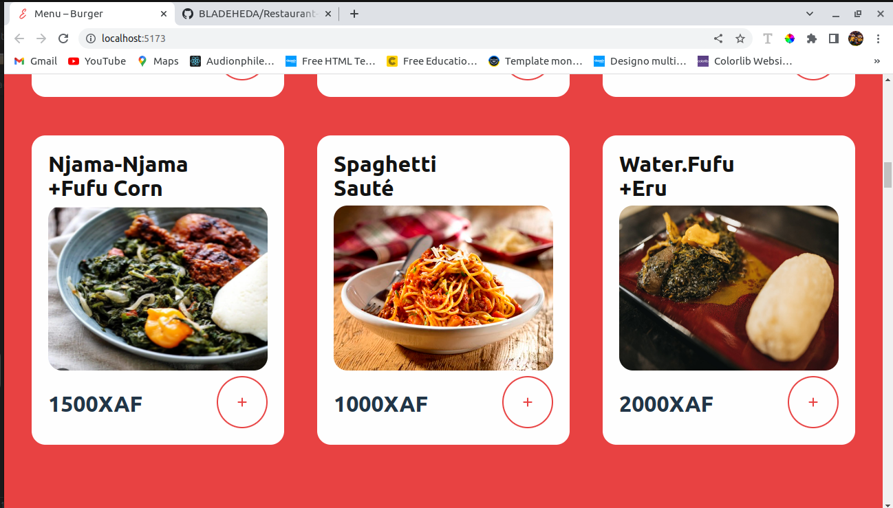

## Project Title: Food Ordering Service Software

## Table of contents

- [Description]  
- [Screenshots]
- [Built with]
- [Group Members]

## Description

- This school group project is a Food Ordering Service Software 
- Our system allows food buyers see dishes available in the food menu for that day so they can order if they wish to. Food vendors are allowed to create accounts, and provide their locations, and deliver the ordered food to the food buyers.

## Screenshots

- 
- 
- 
- 
- 
- 
- 
- 
- 

## Built with

- ReactJS (Front-end)
- Njango (Backend)

## Group Members
- Ambe Mbong-Nwi Nchang -- FE20A007
- Asogna Frank Tongwa -- FE20A012
- Besingi Naura Mabola -- FE20A023
- Nkwetakem Tabo Bruno -- FE20A091

